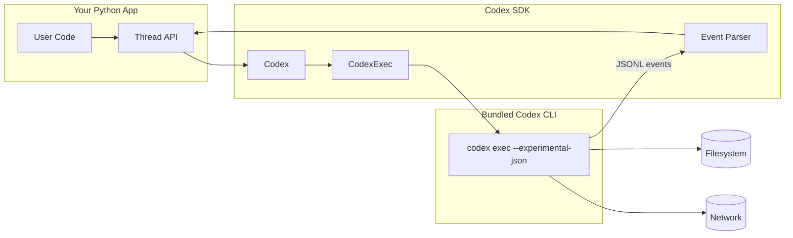
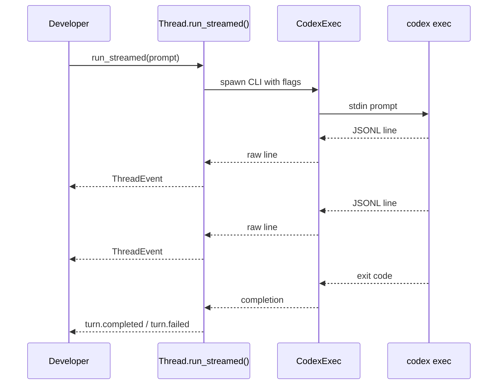
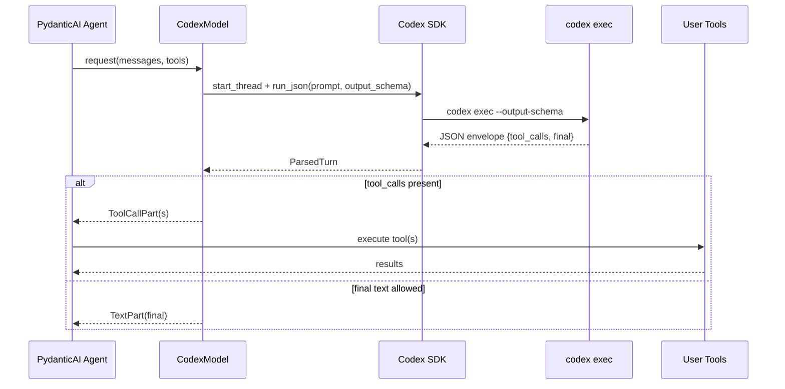
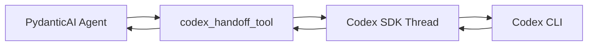

# 

Embed the Codex agent in Python workflows. This SDK wraps the bundled `codex` CLI, streams JSONL events over stdin/stdout, and exposes structured, typed results.

<div align="left">
  <table>
    <tr>
      <td><strong>Lifecycle</strong></td>
      <td>
        <a href="#ci-cd"></a>
        
        <a href="#license"></a>
      </td>
    </tr>
    <tr>
      <td><strong>Core Stack</strong></td>
      <td>
        
        
        
        
        
      </td>
    </tr>
    <tr>
      <td><strong>Navigation</strong></td>
      <td>
        <a href="#quick-start"></a>
        <a href="#features"></a>
        <a href="#configuration"></a>
        <a href="#pydantic-ai"></a>
        <a href="#architecture"></a>
        <a href="#testing"></a>
      </td>
    </tr>
  </table>
</div>

- Runtime dependency-free: uses only the Python standard library.
- Codex CLI binaries are downloaded separately; use `scripts/setup_binary.py` from the repo or install the Codex CLI and set `codex_path_override`.
- Async-first API with sync helpers, streaming events, and structured output.
- Python 3.8/3.9 support is deprecated and will be removed in a future release; use Python 3.10+.

<a id="quick-start"></a>
## 

1. Install the SDK:

```bash
uv add codex-sdk-python
```

2. Ensure a `codex` binary is available (required for local runs):

```bash
# From the repo source (downloads vendor binaries)
python scripts/setup_binary.py
```

If you installed from PyPI, install the Codex CLI separately and either add it to your PATH
or pass `CodexOptions.codex_path_override`.

3. Authenticate with Codex:

```bash
codex login
```

Or export an API key:

```bash
export CODEX_API_KEY="<your-api-key>"
```

4. Run a first turn:

```python
import asyncio
from codex_sdk import Codex

async def main() -> None:
    codex = Codex()
    thread = codex.start_thread()
    turn = await thread.run("Diagnose the test failure and propose a fix")
    print(turn.final_response)
    print(turn.items)

if __name__ == "__main__":
    asyncio.run(main())
```

For single-turn sessions with approval handling, use the turn session wrapper:

```python
import asyncio
from codex_sdk import AppServerClient, AppServerOptions, ApprovalDecisions

async def main() -> None:
    async with AppServerClient(AppServerOptions()) as app:
        thread = await app.thread_start(model="gpt-5-codex-high", cwd=".")
        thread_id = thread["thread"]["id"]
        session = await app.turn_session(
            thread_id,
            "Run tests and summarize failures.",
            approvals=ApprovalDecisions(command_execution="accept"),
        )

        async for notification in session.notifications():
            print(notification.method)

        final_turn = await session.wait()
        print(final_turn)

if __name__ == "__main__":
    asyncio.run(main())
```

### Examples

Try the examples under `examples/`:

```bash
python examples/basic_usage.py
python examples/streaming_example.py
python examples/thread_resume.py
python examples/app_server_basic.py
python examples/app_server_fork.py
python examples/app_server_requirements.py
python examples/app_server_skill_input.py
python examples/app_server_approvals.py
python examples/app_server_turn_session.py
python examples/config_overrides.py
python examples/hooks_streaming.py
python examples/notify_hook.py
```

<a id="features"></a>
## 

| Feature Badge                                                                                                      | Details                                                                 |
| ------------------------------------------------------------------------------------------------------------------ | ----------------------------------------------------------------------- |
|  | Each `Thread` keeps context; resume by thread id or last session.        |
|     | `run_streamed()` yields structured events as they happen.               |
|   | `ThreadHooks` lets you react to streamed events inline.                 |
|  | `run_json()` validates JSON output against a schema.                    |
|  | `run_pydantic()` derives schema and validates with Pydantic v2.         |
|  | Thread options map to Codex CLI sandbox and approval policies.          |
|  | Codex can act as a PydanticAI model or as a delegated tool.            |
|                 | Cancel running turns via `AbortController` and `AbortSignal`.           |
|  | Optional spans if Logfire is installed and initialized.                 |

<a id="configuration"></a>
## 

### Installation extras

```bash
uv add "codex-sdk-python[pydantic]"      # Pydantic v2 schema helpers
uv add "codex-sdk-python[pydantic-ai]"   # PydanticAI integrations
uv add "codex-sdk-python[logfire]"       # Optional tracing
```

### Environment variables

```bash
CODEX_API_KEY=<api-key>
OPENAI_BASE_URL=https://api.openai.com/v1
CODEX_HOME=~/.codex
```

Notes:
- `CODEX_API_KEY` is forwarded to the `codex` process; `CodexOptions.api_key` overrides the environment.
- `OPENAI_BASE_URL` is set when `CodexOptions.base_url` is provided.
- `CODEX_HOME` controls where sessions are stored and where `resume_last_thread()` looks.

### CodexOptions (client)

```python
from codex_sdk import Codex, CodexOptions

codex = Codex(
    CodexOptions(
        codex_path_override="/path/to/codex",
        base_url="https://api.openai.com/v1",
        api_key="<key>",
        env={"CUSTOM_ENV": "custom"},
        config_overrides={
            "analytics.enabled": True,
            "notify": ["python3", "/path/to/notify.py"],
        },
    )
)
```

- `codex_path_override`: use a custom CLI binary path.
- `base_url`: sets `OPENAI_BASE_URL` for the child process.
- `api_key`: sets `CODEX_API_KEY` for the child process.
- `env`: when set, replaces inherited environment variables; the SDK still injects required values.

### ThreadOptions (per thread)

```python
from codex_sdk import ThreadOptions

ThreadOptions(
    model="gpt-5-codex-high",
    sandbox_mode="workspace-write",
    working_directory="/path/to/project",
    skip_git_repo_check=True,
    model_reasoning_effort="high",
    network_access_enabled=True,
    web_search_enabled=False,
    web_search_cached_enabled=False,
    shell_snapshot_enabled=True,
    background_terminals_enabled=True,
    apply_patch_freeform_enabled=False,
    exec_policy_enabled=True,
    remote_models_enabled=False,
    request_compression_enabled=True,
    approval_policy="on-request",
    additional_directories=["../shared"],
    config_overrides={"analytics.enabled": True},
)
```

Important mappings to the Codex CLI:
- `sandbox_mode` maps to `--sandbox` (`read-only`, `workspace-write`, `danger-full-access`).
- `working_directory` maps to `--cd`.
- `additional_directories` maps to repeated `--add-dir`.
- `skip_git_repo_check` maps to `--skip-git-repo-check`.
- `model_reasoning_effort` maps to `--config model_reasoning_effort=...`.
- `network_access_enabled` maps to `--config sandbox_workspace_write.network_access=...`.
- `web_search_enabled` maps to `--config features.web_search_request=...`.
- `web_search_cached_enabled` maps to `--config features.web_search_cached=...`.
- `shell_snapshot_enabled` maps to `--config features.shell_snapshot=...`.
- `background_terminals_enabled` maps to `--config features.unified_exec=...`.
- `apply_patch_freeform_enabled` maps to `--config features.apply_patch_freeform=...`.
- `exec_policy_enabled` maps to `--config features.exec_policy=...`.
- `remote_models_enabled` maps to `--config features.remote_models=...`.
- `request_compression_enabled` maps to `--config features.enable_request_compression=...`.
- `feature_overrides` maps to `--config features.<key>=...` (explicit options take precedence).
- `approval_policy` maps to `--config approval_policy=...`.
- `config_overrides` maps to repeated `--config key=value` entries.

Note: `skills_enabled` is deprecated in Codex 0.80+ (skills are always enabled).

Feature overrides example:

```python
ThreadOptions(
    feature_overrides={
        "web_search_cached": True,
        "powershell_utf8": True,
    }
)
```

### App server (JSON-RPC)

For richer integrations (thread fork, requirements, explicit skill input), use the app-server
protocol. The client handles the initialize/initialized handshake and gives you access to
JSON-RPC notifications.

```python
import asyncio
from codex_sdk import AppServerClient, AppServerOptions

async def main() -> None:
    async with AppServerClient(AppServerOptions()) as app:
        thread = await app.thread_start(model="gpt-5-codex-high", cwd=".")
        thread_id = thread["thread"]["id"]
        await app.turn_start(
            thread_id,
            [
                {"type": "text", "text": "Use $my-skill and summarize."},
                {"type": "skill", "name": "my-skill", "path": "/path/to/SKILL.md"},
            ],
        )

        async for notification in app.notifications():
            print(notification.method, notification.params)

if __name__ == "__main__":
    asyncio.run(main())
```

#### App-server convenience methods

The SDK also exposes helpers for most app-server endpoints:

- Threads: `thread_list`, `thread_archive`, `thread_rollback`, `thread_loaded_list`
- Config: `config_read`, `config_value_write`, `config_batch_write`, `config_requirements_read`
- Skills: `skills_list`
- Turns/review: `turn_start`, `turn_interrupt`, `review_start`, `turn_session`
- Models: `model_list`
- One-off commands: `command_exec`
- MCP auth/status: `mcp_server_oauth_login`, `mcp_server_refresh`, `mcp_server_status_list`
- Account: `account_login_start`, `account_login_cancel`, `account_logout`,
  `account_rate_limits_read`, `account_read`
- Feedback: `feedback_upload`

These map 1:1 to the Codex app-server protocol; see `codex/codex-rs/app-server/README.md`
for payload shapes and event semantics.

### Observability (OTEL) and notify

Codex emits OTEL traces/logs/metrics when configured in `~/.codex/config.toml`.
For headless runs (`codex exec`), set `analytics.enabled=true` and provide OTEL exporters
in the config file. You can also pass overrides with `config_overrides`.

```python
CodexOptions(
    config_overrides={
        "analytics.enabled": True,
        "notify": ["python3", "/path/to/notify.py"],
    }
)
```

See `examples/notify_hook.py` for a ready-to-use notify script.

### TurnOptions (per turn)

```python
from codex_sdk import TurnOptions

TurnOptions(
    output_schema={"type": "object", "properties": {"ok": {"type": "boolean"}}},
    signal=controller.signal,
)
```

- `output_schema` must be a JSON object (mapping). The SDK writes it to a temp file and passes `--output-schema`.
- `signal` is an `AbortSignal` for canceling an in-flight turn.

### Bundled CLI binary and platform support

The SDK resolves a platform-specific Codex CLI binary under `src/codex_sdk/vendor/<target>/codex/`.
It selects the target triple based on OS and CPU and ensures the binary is executable on POSIX.

Supported target triples:
- Linux: `x86_64-unknown-linux-musl`, `aarch64-unknown-linux-musl`
- macOS: `x86_64-apple-darwin`, `aarch64-apple-darwin`
- Windows: `x86_64-pc-windows-msvc`, `aarch64-pc-windows-msvc`

If you are working from source and the vendor directory is missing, run `python scripts/setup_binary.py`
or follow `SETUP.md` to download the official npm package and copy the `vendor/` directory.

<a id="auth"></a>
## 

The SDK delegates authentication to the Codex CLI:
- Run `codex login` to create local credentials (stored under `~/.codex/` by the CLI).
- Or set `CODEX_API_KEY` (or pass `CodexOptions.api_key`) for headless use.
- `CodexOptions.base_url` sets `OPENAI_BASE_URL` to target an OpenAI-compatible endpoint.

<a id="usage"></a>
## 

### Basic run

```python
from codex_sdk import Codex

codex = Codex()
thread = codex.start_thread()
turn = await thread.run("Summarize the repository")
print(turn.final_response)
```

### Sync helpers (non-async)

```python
from pydantic import BaseModel

class RepoStatus(BaseModel):
    summary: str

turn = thread.run_sync("Summarize the repository")
parsed = thread.run_json_sync("Summarize", output_schema={"type": "object"})
validated = thread.run_pydantic_sync("Summarize", output_model=RepoStatus)
```

Note: sync helpers raise `CodexError` if called from an active event loop.

### Streaming events

```python
result = await thread.run_streamed("Diagnose the test failure")
async for event in result.events:
    if event.type == "item.completed":
        print(event.item.type)
    elif event.type == "turn.completed":
        print(event.usage)
```

To iterate directly without the wrapper:

```python
async for event in thread.run_streamed_events("Diagnose the test failure"):
    print(event.type)
```

### Hooks for streamed events

Use `ThreadHooks` to react to events without manually wiring an event loop.

```python
from codex_sdk import ThreadHooks

hooks = ThreadHooks(
    on_event=lambda event: print("event", event.type),
    on_item_type={
        "command_execution": lambda item: print("command", item.command),
    },
)

turn = await thread.run_with_hooks("Run the tests and summarize failures.", hooks=hooks)
print(turn.final_response)
```

### Event types (ThreadEvent)

- `thread.started`
- `turn.started`
- `turn.completed` (includes token usage)
- `turn.failed`
- `item.started`
- `item.updated`
- `item.completed`
- `error`

### Item types (ThreadItem)

- `agent_message`
- `reasoning`
- `command_execution`
- `file_change`
- `mcp_tool_call`
- `web_search`
- `todo_list`
- `error`

### Structured output (JSON schema)

```python
schema = {
    "type": "object",
    "properties": {
        "summary": {"type": "string"},
        "status": {"type": "string", "enum": ["ok", "action_required"]},
    },
    "required": ["summary", "status"],
    "additionalProperties": False,
}

result = await thread.run_json("Summarize repository status", output_schema=schema)
print(result.output)
```

### Pydantic output validation

```python
from pydantic import BaseModel

class RepoStatus(BaseModel):
    summary: str
    status: str

result = await thread.run_pydantic("Summarize repository status", output_model=RepoStatus)
print(result.output)
```

### Images + text

```python
turn = await thread.run(
    [
        {"type": "text", "text": "Describe these screenshots"},
        {"type": "local_image", "path": "./ui.png"},
        {"type": "text", "text": "Focus on failures"},
        {"type": "local_image", "path": "./diagram.jpg"},
    ]
)
```

### Abort a running turn

```python
import asyncio
from codex_sdk import AbortController, TurnOptions

controller = AbortController()
options = TurnOptions(signal=controller.signal)

task = asyncio.create_task(thread.run("Long task", options))
controller.abort("user requested cancel")
await task
```

### Thread resume helpers

```python
from codex_sdk import Codex

codex = Codex()
thread = codex.resume_thread("<thread-id>")

# Or resume the most recent session (uses CODEX_HOME or ~/.codex)
last_thread = codex.resume_last_thread()
```

### Turn helpers

Each `Turn` provides convenience filters: `agent_messages()`, `reasoning()`, `commands()`,
`file_changes()`, `mcp_tool_calls()`, `web_searches()`, `todo_lists()`, and `errors()`.

<a id="api"></a>
## 

Core classes:
- `Codex`: `start_thread()`, `resume_thread()`, `resume_last_thread()`.
- `Thread`: `run()`, `run_streamed()`, `run_streamed_events()`, `run_json()`, `run_pydantic()`,
  plus `run_sync()`, `run_json_sync()`, `run_pydantic_sync()`.
- `Turn`: `items`, `final_response`, `usage`, and helper filters.
- `AppServerClient`, `AppServerTurnSession`, `ApprovalDecisions` for app-server integrations.
- `ThreadHooks` for event callbacks.
- `CodexOptions`, `ThreadOptions`, `TurnOptions`.
- `AbortController`, `AbortSignal`.

Exceptions:
- `CodexError`, `CodexCLIError`, `CodexParseError`, `CodexAbortError`, `TurnFailedError`.

Typed events and items:
- `ThreadEvent` union of `thread.*`, `turn.*`, `item.*`, and `error` events.
- `ThreadItem` union of `agent_message`, `reasoning`, `command_execution`, `file_change`,
  `mcp_tool_call`, `web_search`, `todo_list`, `error`.

<a id="examples"></a>
## 

Example scripts under `examples/`:

- `basic_usage.py`: minimal `Codex` + `Thread` usage.
- `streaming_example.py`: live event streaming.
- `structured_output.py`: JSON schema output parsing.
- `thread_resume.py`: resume with `CODEX_THREAD_ID`.
- `permission_levels_example.py`: sandbox modes and working directory.
- `model_configuration_example.py`: model selection and endpoint config.
- `app_server_turn_session.py`: approval-handled turns over app-server.
- `hooks_streaming.py`: event hooks for streaming runs.
- `notify_hook.py`: notify script for CLI callbacks.
- `pydantic_ai_model_provider.py`: Codex as a PydanticAI model provider.
- `pydantic_ai_handoff.py`: Codex as a PydanticAI tool.

<a id="sandbox"></a>
## 

The SDK forwards sandbox and approval controls directly to `codex exec`.

- `read-only`: can read files and run safe commands, no writes.
- `workspace-write`: can write inside the working directory and added directories.
- `danger-full-access`: unrestricted (use with caution).

Additional controls:
- `working_directory`: restricts where the CLI starts and what it can access.
- `additional_directories`: allowlist extra folders when using `workspace-write`.
- `approval_policy`: `never`, `on-request`, `on-failure`, `untrusted`.
- `network_access_enabled`: toggles network access in workspace-write sandbox.
- `web_search_enabled`: toggles web search requests.

<a id="pydantic-ai"></a>
## 

This SDK offers two ways to integrate with PydanticAI:

### 1) Codex as a PydanticAI model provider

Use `CodexModel` to delegate tool-call planning and text generation to Codex, while PydanticAI executes tools and validates outputs.

```python
from pydantic_ai import Agent, Tool

from codex_sdk.integrations.pydantic_ai_model import CodexModel
from codex_sdk.options import ThreadOptions

def add(a: int, b: int) -> int:
    return a + b

model = CodexModel(
    thread_options=ThreadOptions(
        model="gpt-5",
        sandbox_mode="read-only",
        skip_git_repo_check=True,
    )
)
agent = Agent(model, tools=[Tool(add)])

result = agent.run_sync("What's 19 + 23? Use the add tool.")
print(result.output)
```

How it works:
- `CodexModel` builds a JSON schema envelope with `tool_calls` and `final`.
- Codex emits tool calls as JSON strings; PydanticAI runs them.
- If `allow_text_output` is true, Codex can place final text in `final`.

Safety defaults (you can override with your own `ThreadOptions`):
- `sandbox_mode="read-only"`
- `skip_git_repo_check=True`
- `approval_policy="never"`
- `web_search_enabled=False`
- `network_access_enabled=False`

### 2) Codex as a PydanticAI tool (handoff)

Register Codex as a tool and let a PydanticAI agent decide when to delegate tasks.

```python
from pydantic_ai import Agent

from codex_sdk import ThreadOptions
from codex_sdk.integrations.pydantic_ai import codex_handoff_tool

tool = codex_handoff_tool(
    thread_options=ThreadOptions(
        sandbox_mode="workspace-write",
        skip_git_repo_check=True,
        working_directory=".",
    ),
    include_items=True,
    items_limit=20,
)

agent = Agent(
    "openai:gpt-5",
    tools=[tool],
    system_prompt=(
        "You can delegate implementation details to the codex_handoff tool. "
        "Use it for repository-aware edits, command execution, or patches."
    ),
)

result = await agent.run(
    "Use the codex_handoff tool to scan this repository and suggest one small DX improvement."
)
print(result.output)
```

Handoff options:
- `persist_thread`: keep a single Codex thread across tool calls (default true).
- `include_items`: include a summarized item list in tool output.
- `items_limit`: cap the number of items returned.
- `include_usage`: include token usage.
- `timeout_seconds`: wrap the run in `asyncio.wait_for`.

<a id="telemetry"></a>
## 

If `logfire` is installed and initialized, the SDK emits spans:
- `codex_sdk.exec`
- `codex_sdk.thread.turn`
- `codex_sdk.pydantic_ai.model_request`
- `codex_sdk.pydantic_ai.handoff`

If Logfire is missing or not initialized, the span context manager is a no-op.

<a id="architecture"></a>
<a id="acheature"></a>
## 

### System components



### Streaming event lifecycle



### PydanticAI model-provider loop



### PydanticAI handoff tool



<a id="testing"></a>
## 

This repo uses unit tests with mocked CLI processes to keep the test suite fast and deterministic.

Test focus areas:
- `tests/test_exec.py`: CLI invocation, environment handling, config flags, abort behavior.
- `tests/test_thread.py`: parsing, streaming, JSON schema, Pydantic validation, input normalization.
- `tests/test_codex.py`: resume helpers and option wiring.
- `tests/test_abort.py`: abort signal semantics.
- `tests/test_telemetry.py`: Logfire span behavior.
- `tests/test_pydantic_ai_*`: PydanticAI model provider and handoff integration.

### Run tests

```bash
uv sync
uv run pytest
```

Note: PydanticAI tests are skipped unless `pydantic-ai` is installed.

### Coverage

```bash
uv run pytest --cov=codex_sdk
```

Coverage is configured in `pyproject.toml` with `fail_under = 95`.

### Upgrade checklist

For SDK release updates, follow `UPGRADE_CHECKLIST.md`.

### Format and lint

```bash
uv run black src tests
uv run isort src tests
uv run flake8 src tests
```

### Type checking

```bash
uv run mypy src
```

<a id="ci-cd"></a>
## 

This repository includes GitHub Actions workflows under `.github/workflows/`.
The CI pipeline runs linting, type checks, and `pytest --cov=codex_sdk`.
Release automation creates GitHub releases from `CHANGELOG_SDK.md` when you push a
`vX.Y.Z` tag or manually dispatch the workflow, then the publish workflow uploads
the package to PyPI on release publish.

<a id="operations"></a>
## 

- Sessions are stored under `~/.codex/sessions` (or `CODEX_HOME`).
- Use `resume_thread(thread_id)` to continue a known session.
- Use `resume_last_thread()` to pick the most recent session automatically.
- Clean up stale sessions by removing old `rollout-*.jsonl` files if needed.

<a id="troubleshooting"></a>
## 

- **Codex CLI exited non-zero**: Catch `CodexCLIError` and inspect `.stderr`.
- **Unknown event type**: `CodexParseError` means the CLI emitted an unexpected JSONL entry.
- **Turn failed**: `TurnFailedError` indicates a `turn.failed` event.
- **Run canceled**: `CodexAbortError` indicates a triggered `AbortSignal`.
- **No thread id**: Ensure a `thread.started` event is emitted before resuming.

<a id="production"></a>
## 

- Prefer `read-only` or `workspace-write` sandboxes in production.
- Set `working_directory` to a repo root and keep `skip_git_repo_check=False` where possible.
- Configure `approval_policy` for any tool execution requiring user consent.
- Disable `web_search_enabled` and `network_access_enabled` unless explicitly needed.

<a id="license"></a>
## 

Apache-2.0
